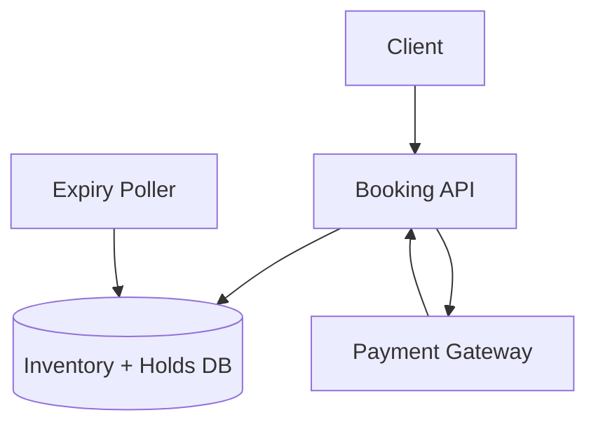

# Ticket / Inventory Booking System

## 1. Problem

Design a reservation and booking system for two different inventory scenarios:

1. Scarce, high-contention inventory — concert/event tickets
2. High-variety, moderate-contention inventory — e-commerce products

Both require atomic inventory reservation, timed holds and independent payment processing.

---

## 2. Requirements

### Shared

- Inventory must never become negative
- Timed holds before payment
- Payment initiation must be idempotent
- Hold and payment are independent transactions
- Expired holds release inventory
- Late successful payments after hold expiry are refunded

### Scenario 1 — Event Tickets

- ~500 total seats
- ~100,000 concurrent attempts during initial sale
- 10-minute cart hold
- 5-minute minimum extension after payment begins

### Scenario 2 — E-Commerce

- Thousands of SKUs
- Lower per-item contention
- 15–30 minute holds
- Each cart item expires independently

---

## 3. Core Design Decision

The two scenarios use the **same concurrency-control pattern**, but different storage mechanisms.

| | Scenario 1 | Scenario 2 |
|---|---|---|
| Inventory | Event tickets | E-commerce SKUs |
| Contention | Extreme | Moderate |
| Source of truth | Redis | Database |
| Atomic decrement | Redis Lua | SQL conditional UPDATE |
| Hold expiry | 2–5 sec polling | 10 sec polling |
| DB role | Async audit | Primary system |

The key lesson is that similar business workflows do not necessarily require identical architectures.

---

## 4. Scenario 1 — High-Contention Tickets

### Architecture

```mermaid
flowchart TD
    Client[Client]
    API[Booking API]
    Redis[(Redis Cluster<br/>Inventory + Holds)]
    Lua[Atomic Lua Script]
    Queue[Audit Queue]
    DB[(Audit DB)]
    Payment[Payment Gateway]
    Poller[Expiry Poller]

    Client --> API
    API --> Lua
    Lua --> Redis

    API --> Payment
    Payment --> API

    Poller --> Redis
    Redis --> Queue
    Queue --> DB
````

### Atomic Reservation

```text
Check available_count > 0
          ↓
Decrement inventory
          ↓
Create hold
```

The check and decrement happen atomically inside Redis.

---

## 5. Scenario 2 — E-Commerce Inventory

### Architecture



### Atomic Reservation

```sql
UPDATE inventory
SET available_count = available_count - 1
WHERE sku_id = ?
  AND available_count > 0;
```

`rows_affected = 0` means the inventory was unavailable.

The database row is locked only for the statement — not for the user's entire checkout session.

---

## 6. Hold Lifecycle

```text
HELD
  ↓
PAYMENT_INITIATED
  ↓
PAID
```

Or:

```text
HELD / PAYMENT_INITIATED
          ↓
       EXPIRED
          ↓
Inventory released
```

Expiry is handled by a background poller.

---

## 7. Payment & Hold Independence

Payment and inventory are deliberately **independent transactions**.

If the hold expires while payment is still processing:

```text
Hold expires
    ↓
Inventory released
    ↓
Payment succeeds later
    ↓
Refund payment
```

The system does **not resurrect the expired reservation**.

This deliberately accepts a rare UX edge case in exchange for a simpler and safer inventory guarantee.

---

## 8. Redis Durability — Scenario 1

Because Redis is the source of truth for scarce inventory:

* AOF persistence is enabled
* Per-second fsync limits the potential loss window
* Replicas provide failover
* Automatic replica promotion handles node failure

Both persistence **and** replication are required.

---

## 9. Cart Expiry — Scenario 2

Each cart item has an independent expiry.

If one item expires:

```text
Cart
├── Item A → Valid
├── Item B → EXPIRED
└── Item C → Valid
```

The system does **not silently remove Item B**.

At checkout, the user is explicitly informed and must acknowledge the change.

---

## 10. Mistakes & Corrections

1. Same architecture assumed for both scenarios → differentiate by contention profile
2. Separate `available_count` + `blocked_count` → derive blocked inventory when required
3. Long-lived DB locks → atomic single-statement update
4. Payment and inventory tightly coupled → independent transactions
5. Late payment restores expired inventory → refund instead
6. Redis TTL used for conditional expiry → application-level poller
7. Same polling interval everywhere → tune interval to the business deadline
8. Silent cart modification → explicit user acknowledgment

---

## 11. Core Takeaways

* Architecture should respond to **constraints**, not just business labels.
* Atomic conditional decrement is the core concurrency pattern.
* A system of record should not be duplicated unnecessarily.
* Payment timing should not dictate inventory correctness.
* Background polling is appropriate when expiry rules depend on application state.
* User-visible state changes should not happen silently.

---

## 12. Patterns Learned

* Atomic conditional decrement
* Timed holds
* Idempotent payment initiation
* Independent transactions
* Refund-after-timeout
* Redis Lua atomicity
* Database conditional updates
* Poller-based expiry
* Fault isolation
* Constraint-driven architecture

