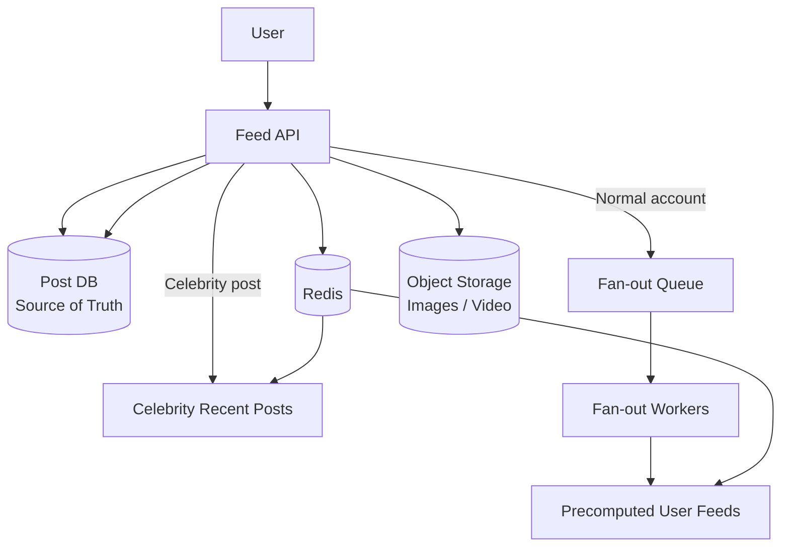

# Social Media News Feed

## 1. Problem

Design a home-timeline feed for 10M users with strictly reverse-chronological ordering.

The key challenge is the **celebrity problem**: some accounts may have millions of followers, making naive fan-out extremely expensive.

---

## 2. Requirements

### Functional

- Create posts
- Support text + media
- Reverse-chronological home feed
- Follow/unfollow users
- Deleted posts must disappear promptly

### Non-Functional

- 10M users
- 50M posts/day
- 200M feed reads/day
- ~4:1 read/write ratio
- New posts/deletions visible within seconds to low minutes
- Support accounts with up to ~5M followers

---

## 3. Core Design Decision — Hybrid Fan-Out

Use different strategies depending on follower count:

| Account | Strategy | Reason |
|---|---|---|
| Normal account | Fan-out-on-write | Makes feed reads cheap |
| Celebrity | Fan-out-on-read | Avoids millions of writes per post |

Example threshold:

```text
< 100K followers → Fan-out-on-write
≥ 100K followers → Fan-out-on-read
````

The threshold is evaluated at post time using the current follower count.

---

## 4. Architecture



---

## 5. Data Model

### User Feed

```text
feed:{user_id}

Redis Sorted Set
score = post timestamp
value = post_id

Maximum: 800 entries
```

### Celebrity Posts

```text
celebrity_recent_posts:{celebrity_id}

Redis Sorted Set
score = timestamp
value = post_id

Maximum: ~50 posts
```

### Posts

```text
posts

post_id
author_id
text
media_url
created_at
status
```

The database remains the source of truth for post content and deletion status.

---

## 6. Write Path

### Normal Account

```text
User posts
   ↓
Store post in DB
   ↓
Fan-out event
   ↓
Fetch followers
   ↓
Chunk followers
   ↓
Parallel workers
   ↓
Pipeline Redis ZADD
   ↓
Trim feeds to latest 800
```

### Celebrity

```text
User posts
   ↓
Store post in DB
   ↓
ZADD celebrity_recent_posts
```

No millions-of-followers fan-out occurs.

---

## 7. Read Path

```text
User opens feed
      ↓
Read precomputed feed
      ↓
Get celebrities followed
      ↓
Read their recent posts
      ↓
Merge by timestamp
      ↓
Resolve post content
      ↓
Filter DELETED posts
      ↓
Return top N
```

This combines the precomputed normal-user feed with live celebrity content.

---

## 8. Deletion

Deletion uses a **tombstone** rather than deleting the post from every user's feed.

```text
UPDATE posts
SET status = 'DELETED'
```

The post cache is synchronously invalidated.

Feed entries may still contain the `post_id`, but read-time resolution checks the authoritative status and filters deleted posts.

This avoids expensive delete fan-out.

---

## 9. Fan-Out Reliability

Follower lists are processed in chunks:

```text
5,000,000 followers
        ↓
chunks of 500
        ↓
parallel workers
        ↓
pipelined ZADD
```

Each chunk is independently retryable.

Redis `ZADD` is idempotent, making redelivery safe.

---

## 10. Threshold Crossing

No special migration process is required when an account crosses the celebrity threshold.

Existing feed entries naturally age out because each feed is capped at 800 posts.

This avoids additional backfill/cleanup complexity.

---

## 11. Key Trade-offs

| Decision                  | Alternative                | Reason                                 |
| ------------------------- | -------------------------- | -------------------------------------- |
| Hybrid fan-out            | Pure write/read fan-out    | Handles asymmetric celebrity load      |
| Redis celebrity structure | DB query per celebrity     | Faster and bounded                     |
| Live threshold check      | Periodic recalculation     | Always reflects current follower count |
| Tombstone deletion        | Delete from every feed     | Avoids expensive delete fan-out        |
| Chunked fan-out           | One large worker operation | Limits failure blast radius            |
| Pipelined writes          | Individual Redis calls     | Reduces network round-trips            |

---

## 12. Core Takeaways

* Fan-out cost can be paid at write-time or read-time.
* The right strategy depends on where the load is asymmetric.
* Precomputation trades write cost for read performance.
* Chunking + batching + idempotency is a reusable distributed-system pattern.
* Existing bounded data structures can sometimes eliminate the need for special cleanup logic.
* Separate **architectural reasoning** from technology-specific syntax.

---

## 13. Patterns Learned

* Hybrid fan-out
* Fan-out-on-write
* Fan-out-on-read
* Batching
* Chunking
* Idempotent processing
* Tombstone deletion
* Cache invalidation
* Bounded data structures

