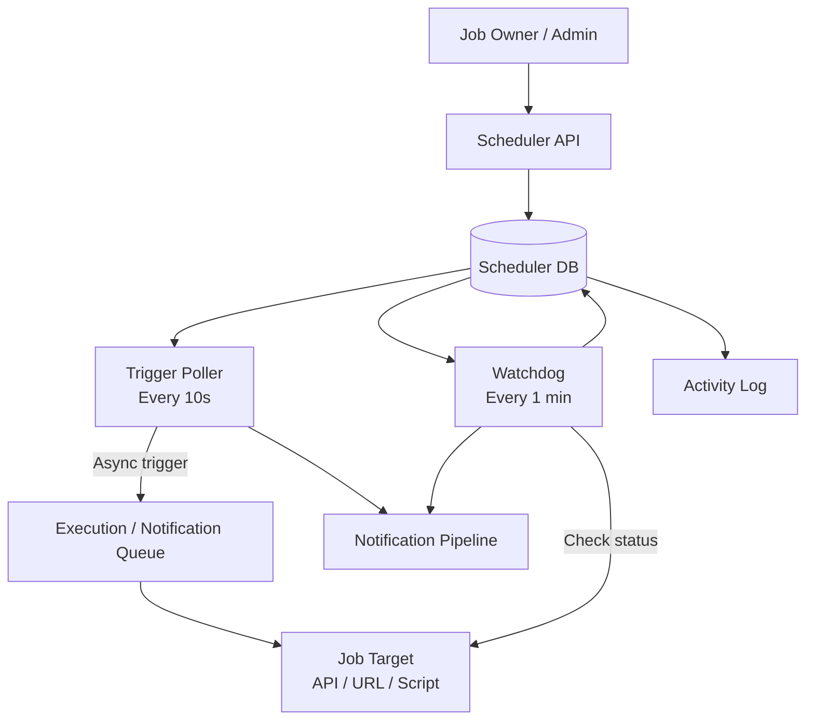

# Distributed Job Scheduler

## 1. Problem

Design a centralized cron-as-a-service platform allowing teams to schedule recurring jobs without building their own scheduling infrastructure.

The scheduler must handle missed triggers, overlapping runs, stuck jobs, retries, and notifications.

Scale: ~10,000 jobs with 1-minute schedule granularity.

---

## 2. Requirements

### Functional

- Define recurring jobs
- Support API / URL / script targets
- Configure retry and failure policies
- Configure overlap policy:
  - SKIP
  - WAIT
  - CONCURRENT
- Trigger jobs asynchronously
- Detect stuck / timed-out jobs
- Detect missed runs after scheduler downtime
- Notify support and job owners
- Alert when a job develops a structural backlog

### Non-Functional

- No single point of failure
- Multiple scheduler instances
- No double-triggering of the same scheduled run

---

## 3. Data Model

### JobMaster

```text
job_id
name
target
owner
expected_max_duration
overlap_policy
failure_policy
status
````

### JobSchedule

```text
job_id
cron_expression
next_run_at
last_run_at
```

### JobRun

```text
run_id
job_id
triggered_at
status
completed_at
```

### JobNotifications

```text
job_id
notification_type
recipient_config
```

### ActivityLog

Records status transitions and retry attempts.

---

## 4. Architecture



---

## 5. Why Two Pollers?

The scheduler has two different questions:

```text
Trigger Poller
"Is it time to start something?"

Watchdog
"Is something already running correctly?"
```

They have different requirements and therefore different polling frequencies.

### Trigger Poller

Every ~10 seconds:

```sql
SELECT *
FROM JobSchedule
WHERE next_run_at <= NOW()
  AND status = 'ACTIVE'
FOR UPDATE SKIP LOCKED
LIMIT 100;
```

### Watchdog

Every ~1 minute:

```sql
SELECT *
FROM JobRun
WHERE status IN ('TRIGGERED', 'RUNNING')
FOR UPDATE SKIP LOCKED
LIMIT 100;
```

`SKIP LOCKED` allows multiple instances to process work without claiming the same record.

---

## 6. Job Trigger Flow

```text
Schedule becomes due
        ↓
Trigger Poller claims job
        ↓
Check overlap policy
        ↓
Trigger target asynchronously
        ↓
Create JobRun
        ↓
Update next_run_at
```

The scheduler does **not** wait for the target job to complete.

---

## 7. Overlap Policies

### SKIP

If a previous run is still running:

```text
Create SKIPPED JobRun
```

### WAIT

Do nothing during this poll cycle.

The next poll naturally re-checks the condition.

No additional `PENDING` state is required.

### CONCURRENT

Trigger the new run regardless of the previous run's state.

---

## 8. Watchdog

The watchdog checks `TRIGGERED` and `RUNNING` jobs.

```text
JobRun
  ↓
Check actual job status
  ↓
SUCCESS / FAILED
```

If:

```text
NOW - triggered_at > expected_max_duration
```

mark the run as:

```text
TIMEOUT
```

Then apply the configured failure policy:

```text
RETRY / ALERT / MARK FAILED
```

---

## 9. Missed Runs After Downtime

On scheduler recovery:

```text
Scheduler starts
      ↓
Compare schedules against downtime
      ↓
Identify missed runs
      ↓
Notify support
      ↓
Human decides whether to rerun
```

The system deliberately does **not** automatically replay missed jobs.

Reason: jobs may be business-sensitive or interdependent.

---

## 10. Backlog Detection

If a job accumulates more than five pending/skipped-due-to-WAIT runs:

```text
Backlog > 5
      ↓
Alert support
```

This distinguishes a structural scheduling problem from a temporary delay.

---

## 11. Key Design Decisions

| Decision         | Choice                       | Why                                                     |
| ---------------- | ---------------------------- | ------------------------------------------------------- |
| Pollers          | Two separate services        | Triggering and health checking have different semantics |
| Poller instances | Multiple                     | Avoids single point of failure                          |
| Claiming         | `FOR UPDATE SKIP LOCKED`     | Prevents duplicate processing                           |
| Job execution    | Asynchronous                 | Scheduler shouldn't wait for completion                 |
| WAIT policy      | Natural poll re-check        | Avoids unnecessary state                                |
| Timeout          | `expected_max_duration`      | Makes "stuck" explicit                                  |
| Missed runs      | Notify + human decision      | Avoids unsafe automatic replay                          |
| Backlog alert    | Threshold > 5                | Detects structural lag                                  |
| Notifications    | Shared notification pipeline | Reuses existing dispatch pattern                        |

---

## 12. Mistakes & Corrections

1. One poller for everything → separate trigger and watchdog loops
2. Single poller instance → multi-instance with `SKIP LOCKED`
3. Scheduler waits for job completion → asynchronous triggering
4. Explicit WAIT/PENDING state → natural poll re-check
5. Infer stuck jobs heuristically → require `expected_max_duration`
6. Automatically replay missed jobs → human-controlled recovery
7. Treat all backlog as transient → explicit backlog threshold

---

## 13. Core Takeaways

* Similar-looking background processes can have different semantics and should not automatically share the same loop.
* `SKIP LOCKED` is a reusable distributed worker-claiming pattern.
* A scheduler should trigger work, not synchronously execute it.
* Explicit business configuration is safer than heuristic inference.
* Recovery automation should stop where business context is required.

---

## 14. Patterns Learned

* Distributed polling
* `FOR UPDATE SKIP LOCKED`
* Asynchronous job triggering
* Watchdog pattern
* Overlap policies
* Timeout detection
* Missed-run detection
* Human-controlled recovery
* Backlog monitoring

